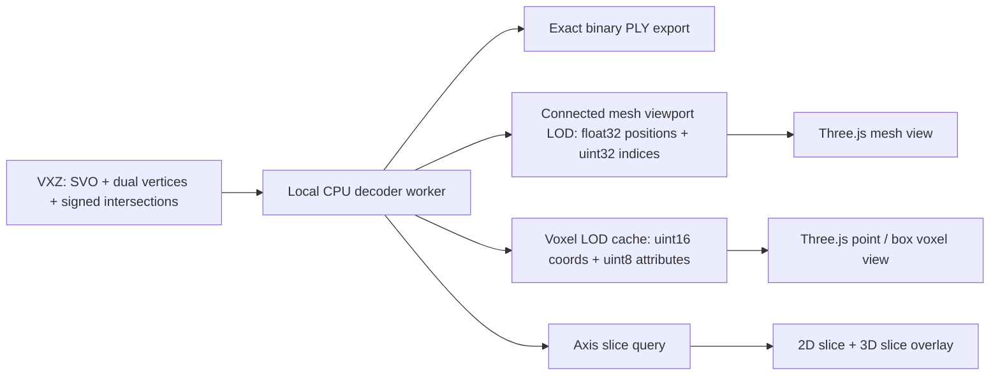

# VXZ mesh + voxel visualization design

## Implemented architecture

The viewer uses a local decoder worker beside the existing Three.js frontend. The worker
opens VXZ once, caches compact binary chunks, and feeds two independent render
paths:



Do not send the full decoded PLY through the current browser `FileReader` path.
The supplied files make the scale clear:

| sample | active voxels / mesh vertices | triangles | full mesh size |
| --- | ---: | ---: | ---: |
| `raw_mesh_normalized` | 21,099,081 | 42,964,134 | 774 MiB binary PLY / 733 MiB GLB |
| `task0_instance14_mesh_fill_watertight` | 16,161,436 | 32,375,528 | about 584 MiB binary PLY / 555 MiB GLB |

Loading one of these as a single JavaScript `ArrayBuffer`, computing normals,
and creating an `EdgesGeometry` copy would require several times the source
size. A coherent viewport LOD is therefore required for a stable viewer.

## Shared coordinate rules

Pixel/grid alignment is the primary acceptance criterion. VXZ uses a
**cell-centered grid**, unlike the existing pipeline `.npy` view, which uses
grid nodes. The VXZ path must therefore not reuse the current
`indexToWorld(index, dimension) = -1 + index * 2 / (dimension - 1)` mapping.

The decoder and both render paths must use the following VXZ mapping:

```text
mesh vertex = (voxel_coord + dual_vertex / 255) / resolution - 0.5
voxel center = (voxel_coord + 0.5) / resolution - 0.5
voxel size   = 1 / resolution
cell i bounds = [-0.5 + i / resolution, -0.5 + (i + 1) / resolution]
```

`intersected` uses six bits. Bits 0–2 mark x/y/z edge presence; bits 3–5
mark the corresponding positive sign and therefore face orientation.

## Exact slice pixel contract

For resolution `R`, every axis slice is a logical `R × R` image. One image
pixel represents exactly one O-Voxel cell; there is no interpolation,
supersampling, averaging, or independent image normalization. Missing sparse
coordinates are background pixels.

The integer mapping is:

| slice | pixel → O-Voxel coordinate |
| --- | --- |
| `X = k` | `(k, R - 1 - py, px)` |
| `Y = k` | `(px, k, R - 1 - py)` |
| `Z = k` | `(px, R - 1 - py, k)` |

The Y-like display axis is flipped only because canvas rows grow downward.
This is an exact integer permutation/flip, not a resampling step. Pixel center
`(px + 0.5, py + 0.5)` maps to the corresponding voxel center.

The 3D slice plane for index `k` is placed at the cell center:

```text
slice_world = -0.5 + (k + 0.5) / R
```

Its in-plane extent is exactly `[-0.5, 0.5]²`. Texture UV boundaries match
cell boundaries, and UV texel centers `(i + 0.5) / R` match voxel centers.
The mesh clipping plane uses the same `slice_world` value.

Rendering requirements:

- use a native `R × R` canvas/texture (`1536 × 1536` for the supplied data);
- write colors with `ImageData` / `putImageData`, without `drawImage` scaling;
- set `imageSmoothingEnabled = false`, `NearestFilter` for min/mag filters,
  and `generateMipmaps = false`;
- provide a native 1:1 scrollable view where one CSS pixel is one grid cell;
- if zoom is offered, use integer zoom levels with nearest-neighbor display;
- pointer inspection applies the table above directly and reports the exact
  `(x, y, z)` cell coordinate and its raw VXZ attributes.

This convention is shared by occupancy, `dual_vertices`, signed-edge color,
mesh cross-section overlays, the 2D slice, and the textured 3D slice plane.
There must be no per-layer offset of half a voxel.

## Mesh path

The local worker reuses the CPU reconstruction in `decode_vxz.py`:

1. Decode each VXZ SVO chunk and its `dual_vertices` / `intersected` streams.
2. Build the coordinate index and connect the four dual vertices around every
   signed x/y/z edge.
3. Keep the current exact binary PLY output as the export/debug artifact.
4. For interactive viewing, emit independently renderable mesh chunks with a
   one-voxel halo so quads crossing a VXZ chunk boundary are not lost.
5. Cache at least two levels: a small preview and the exact chunk. Load preview
   first; replace visible chunks with exact geometry on demand.

The browser payload for one mesh chunk should be deliberately simple:

```text
uint32 vertex_count
uint32 index_count
float32 positions[vertex_count][3]
uint32 indices[index_count]
```

The viewer creates one `THREE.BufferGeometry` per chunk. Frustum-cull chunks,
do not build `EdgesGeometry` for exact/high-density VXZ geometry, and only keep
high-resolution chunks near the camera or inside the current crop box.

## Voxel path

Rendering 20 million `BoxGeometry` instances is not a useful default. Provide
three modes backed by the original sparse voxels:

- **Overview points:** `THREE.Points` with an SVO-derived LOD capped around
  250k–1M points. Coordinates stay as `uint16` on disk and are converted in a
  shader or while building the GPU buffer.
- **ROI boxes:** use `THREE.InstancedMesh` only for the current crop box and
  cap it around 100k voxels. This gives an actual voxel/cube view when zoomed
  in without paying the full-scene cost.
- **Slice:** query voxels at one x/y/z index and render them in the existing 2D
  slice canvas plus the 3D slice plane. This is the most precise way to inspect
  occupancy at resolution 1536.

Keep `dual_vertices` and `intersected` in the voxel payload so the UI can color
by useful O-Voxel diagnostics:

- active occupancy;
- x/y/z intersected edge;
- positive/negative intersection sign;
- dual-vertex local offset;
- VXZ chunk id.

A compact full-resolution voxel record is 10 bytes for these samples:

```text
uint16 coord_x, coord_y, coord_z
uint8 dual_x, dual_y, dual_z
uint8 intersected
```

LOD files contain the same record for one representative per coarser SVO cell,
so switching levels does not require changing shaders.

## Local API and cache

Add VXZ routes to the existing loopback backend (and mirror them in Electron):

| route | result |
| --- | --- |
| `POST /api/vxz/open?name=...` | upload/hash a VXZ and start or reuse its cache job |
| `GET /api/vxz/status?id=...` | decode/cache progress, errors, and metadata |
| `GET /api/vxz/data?id=...&kind=mesh` | connected, vertex-clustered dual-grid mesh LOD |
| `GET /api/vxz/data?id=...&kind=voxels` | sampled voxel overview |
| `GET /api/vxz/slice?id=...&axis=z&index=768` | exact compact records for one slice |

Cache keys are SHA-256 hashes of the VXZ bytes. A cache entry contains
`metadata.json`, memory-mapped exact sparse attributes, a mesh viewport LOD, and a
voxel overview. An explicit grid resolution is folded into the cache key when
the sparse occupied coordinates cannot determine the parent grid boundary.
Cache writes are atomic.

The Node backend spawns the isolated
`.venv-vxz/bin/python` worker and exchanges compact binary records over
stdout. For a distributable app beyond the current local macOS build, replace that runtime dependency with
a signed standalone worker (PyInstaller) or a Rust implementation; the browser
data contract can remain unchanged.

## Viewer controls

Add one `Open VXZ` action and a VXZ panel with:

- visibility toggles for `Mesh`, `Voxels`, and `Dual vertices`;
- voxel mode: `Points`, `Boxes (ROI)`, or `Slice`;
- LOD / point-budget and point-size controls;
- color mode for occupancy, signed edges, dual offset, or chunk;
- resolution, active-voxel, quad, triangle, cache, and GPU-memory estimates;
- decode/export progress and cancellation.

Mesh and voxel objects should share one root transform and the existing camera,
clipping plane, opacity controls, and visibility list. `Both` is then a real
overlay rather than two independently normalized views.

## Delivery status

1. **Decoder/export (done):** CPU VXZ read, signed dual-grid reconstruction,
   auto resolution, atomic binary PLY, directory/file-list input.
2. **Integrated viewer (done):** upload/status/data/slice API, overview points,
   a connected vertex-clustered mesh LOD rendered through the normal mesh pipeline,
   exact native-resolution slices, progress, request
   cancellation, cache reuse, visibility controls, and diagnostic colors.
3. **Next LOD step:** ROI boxes and chunked exact mesh geometry loaded by
   camera/crop demand.
4. **Productization:** remote VXZ paths, a signed standalone worker, cache UI,
   and explicit cache/performance budgets.

The MVP is complete when either supplied VXZ opens without first producing a
774 MiB browser-side buffer, shows a voxel overview within a few seconds,
supports exact slice/ROI inspection, progressively overlays the reconstructed
mesh, and still exports the exact full PLY on demand. Slice acceptance also
requires these deterministic checks:

1. On a synthetic VXZ containing one active cell, each matching X/Y/Z slice
   lights exactly one expected pixel and adjacent slices light none.
2. The two canvas corners map to the exact integer coordinates in the table.
3. `grid → world → pixel` round-trips through cell centers without an off-by-one
   or half-cell offset.
4. A mesh dual vertex and its voxel pixel overlay at the same coordinates.
5. Texture filtering and canvas inspection confirm that no interpolated color
   is introduced between neighboring cells.
